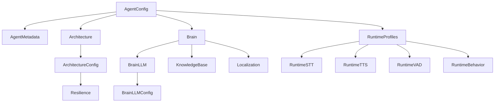

# Agent Configuration Schema Reference

This document provides a detailed reference for the `AgentConfig` schema used to configure AI Voice Agents in Tito AI. The schema is built using Pydantic v2 and is used for both validation and generating API documentation.

## Architecture Overview

The configuration follows a hierarchical structure where the root `AgentConfig` orchestrates several sub-modules:



---

## 1. Root Configuration (`AgentConfig`)

| Field | Type | Required | Description |
| :--- | :--- | :--- | :--- |
| `version` | `str` | Yes | Schema version (e.g., `1.0.0`). |
| `agent_id` | `str` | Yes | Unique identifier for the agent instance. |
| `metadata` | `AgentMetadata` | Yes | Identifying information. |
| `architecture` | `Architecture` | Yes | Core execution logic (Pipeline vs Node). |
| `brain` | `Brain` | Yes | Cognitive settings (LLM, RAG, Locale). |
| `runtime_profiles` | `RuntimeProfiles` | Yes | Technical stack (STT, TTS, VAD). |
| `capabilities` | `AgentCapabilities` | No | Tool and skill definitions (e.g., function calling). |
| `orchestration` | `OrchestrationConfig` | No | Session routing and state management. |
| `compliance` | `ComplianceConfig` | No | Privacy and safety requirements (PII redaction). |
| `observability` | `ObservabilityConfig` | No | Logging and monitoring settings. |

---

## 5. Capabilities (`AgentCapabilities`)

Defines the tools and functions available to the agent for function calling.

| Field | Type | Description |
| :--- | :--- | :--- |
| `name` | `str` | Internal function name recognized by the LLM. |
| `processing_message` | `str` | (Optional) Message to speak while executing (e.g., `procesando su pago`). |
| `description` | `str` | Detailed description of what the tool does. |
| `parameters` | `object` | JSON Schema defining the required arguments. |

---

## 6. Metadata (`AgentMetadata`)

| Field | Type | Description | Example |
| :--- | :--- | :--- | :--- |
| `name` | `str` | Friendly name for the agent. | `"Luna Travel"` |
| `slug` | `str` | URL-friendly identifier. | `"luna-v3"` |
| `description` | `str` | Summary of purpose. | `"Travel assistant"` |
| `tags` | `List[str]` | Categories for filtering. | `["travel", "sales"]` |
| `language` | `str` | Primary language code. | `"es-MX"` |

---

## 3. Brain (`Brain`)

The brain defines how the agent thinks and speaks.

### BrainLLM
| Field | Type | Description |
| :--- | :--- | :--- |
| `provider` | `str` | API Provider (openai, anthropic, groq). |
| `model` | `str` | Model ID (gpt-4o, claude-3-5-sonnet). |
| `instructions`| `str` | System prompt / Persona. |
| `config` | `object` | Temperature, Max Tokens, etc. |

### BrainContext (`BrainContext`)
Controls how the agent manages its conversation history to avoid exceeding context windows.

| Field | Type | Description |
| :--- | :--- | :--- |
| `enabled` | `bool` | Activate automatic context management. |
| `strategy` | `str` | Either `summarize` (default), `truncate`, or `none`. |
| `max_tokens`| `int` | Token limit before a reduction is triggered. |
| `min_messages`| `int` | Number of recent messages to always keep intact. |

#### Context Strategies
| Strategy | Behavior |
| :--- | :--- |
| `summarize` | When the limit is reached, old messages are condensed into a short summary by the LLM. |
| `truncate` | Similar to summarize, but uses a more aggressive prompt to discard old details and keep only essentials. |
| `none` | No management is applied (risks "Context window exceeded" errors). |

---

## 4. Runtime Profiles (`RuntimeProfiles`)

Defines the low-level processing stack for real-time voice.

### Session Limits (`RuntimeSessionLimits`)
| Field | Type | Description |
| :--- | :--- | :--- |
| `inactivity_timeout` | `InactivityTimeout` | Configures how the agent handles user silence. |
| `max_duration_seconds`| `int` | Maximum allowed time for the call. |

### Inactivity Timeout (`InactivityTimeout`)
| Field | Type | Description |
| :--- | :--- | :--- |
| `enabled` | `bool` | Activate/Deactivate silence detection. |
| `steps` | `List[InactivityTimeoutStep]` | Sequence of warning messages and wait times. |

### STT & TTS
| Component | Field | Description |
| :--- | :--- | :--- |
| **STT** | `provider` | deepgram, google, silero. |
| **TTS** | `provider` | cartesia, elevenlabs, playht. |
| **TTS** | `voice_id` | Identifier for the specific voice. |

### VAD (`RuntimeVAD`)
Voice Activity Detection settings.

| Field | Type | Description |
| :--- | :--- | :--- |
| `provider` | `str` | VAD technology (`silero` or `aic`). |
| `params` | `RuntimeVADParams` | Fine-tuning thresholds. |

#### VAD Parameters (`RuntimeVADParams`)
| Field | Default | Description |
| :--- | :--- | :--- |
| `confidence` | `0.7` | Confidence threshold for speech detection (0.0 to 1.0). |
| `start_secs` | `0.2` | Minimum duration of speech required to trigger a state change. |
| `stop_secs` | `0.2` | Duration of silence required to consider speech has ended. |
| `min_volume` | `0.6` | Minimum volume level to consider. |

#### Available VAD Providers
| Provider | Description |
| :--- | :--- |
| `silero` | (Default) Highly accurate and robust ONNX-based VAD. Recommended for most cases. |
| `aic` | AI-Coustics based VAD, specialized in noise suppression environments. |

### Behavior (`RuntimeBehavior`)
Configures how the agent interacts with the user and handles interruptions.

| Field | Type | Description |
| :--- | :--- | :--- |
| `interruptibility` | `bool` | Whether the user can interrupt the agent while speaking. |
| `turn_detection_strategy` | `str` | Strategy to detect turn ends: `smart` (AI model) or `timeout` (silence). |
| `turn_detection_timeout_ms`| `int` | Milliseconds of silence to wait if using `timeout` strategy (default `600`). |
| `smart_turn_stop_secs`| `float` | Seconds of silence to wait if using `smart` strategy before declaring turn complete (default `2.0`). |
| `initial_action` | `str` | First action to take (e.g., `SPEAK_FIRST`). |
| `streaming` | `bool` | Use streaming for LLM and TTS responses. |
| `user_mute_strategies` | `List[str]` | Strategies to selectively ignore user input. |

#### Available Mute Strategies
| Strategy | Description |
| :--- | :--- |
| `until_first_bot_complete` | Mutes user input until the agent finishes its very first response (perfect for greetings). |
| `function_call` | Automatically mutes the user while the agent is executing a tool/function. |
| `first_speech` | Mutes the user during the first bot utterance only. |
| `always` | Mutes the user whenever the bot is speaking (strict turn-taking). |

---

## Example Configuration

```json
{
  "version": "1.0.0",
  "agent_id": "luna-production-001",
  "metadata": {
    "name": "Luna",
    "slug": "luna",
    "description": "Expert travel planning agent",
    "tags": ["travel", "concierge"],
    "language": "en"
  },
  "architecture": {
    "type": "pipeline"
  },
  "brain": {
    "llm": {
      "provider": "openai",
      "model": "gpt-4o",
      "instructions": "You are Luna, a friendly travel assistant."
    },
    "localization": {
      "default_locale": "en-US",
      "timezone": "America/New_York",
      "currency": "USD",
      "number_format": "{:,.2f}"
    }
  },
  "runtime_profiles": {
    "stt": { "provider": "deepgram", "model": "nova-2" },
    "tts": { "provider": "cartesia", "voice_id": "79a125e8-cd45-4c13-8a25-276b322dd2d0" },
    "behavior": {
      "interruptibility": true,
      "initial_action": "SPEAK_FIRST",
      "streaming": true,
      "user_mute_strategies": ["until_first_bot_complete", "function_call"]
    },
    "session_limits": {
      "inactivity_timeout": {
        "enabled": true,
        "steps": [
          { "wait_seconds": 10, "message": ["Are you there?"] },
          { "wait_seconds": 5, "message": ["I'm still here if you need me."] }
        ]
      }
    }
  },
  "capabilities": {
    "tools": [
      {
        "name": "book_flight",
        "description": "Book a flight for the user",
        "parameters": {
          "type": "object",
          "properties": { "dest": { "type": "string" } }
        }
      }
    ]
  }
}
```
